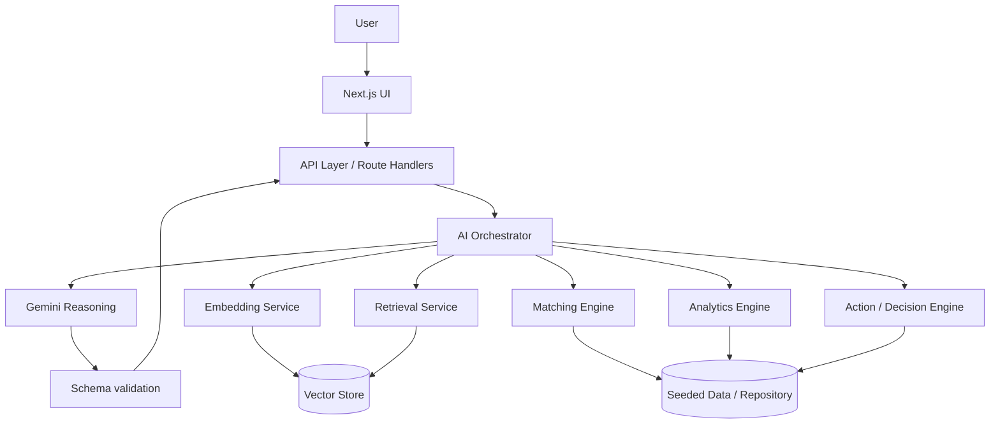

# AMBE INTELLIGENCE
### AI Workforce & Executive Command Center
**From skills to opportunity. From decisions to execution.**

> **Strategic AI Prototype — Concept Demonstration.**
> This is not an official Ambe International product and is not affiliated with the company.
> Every candidate, client, market and metric in this application is fictional, created for this
> prototype, and labelled *Illustrative prototype data* in the interface.

---

## 1. Product Overview

Ambe Intelligence is an internal AI platform for an international recruitment and workforce-mobility
business. It has two layers that share one data and intelligence spine.

**Layer 1 — AI Recruitment Intelligence.** Help recruiters find the right people faster:

```
Job requirement → AI requirement analysis → skill extraction → candidate retrieval
→ semantic matching → deterministic scoring → skill-gap analysis
→ training recommendations → interview questions → recruiter decision support
```

**Layer 2 — Chief of Staff Command Center.** Help leadership answer, in order:

```
What is happening? → Why is it happening? → What matters? → What should we do?
→ Who owns it? → By when? → Did it get done?
```

The product model the UI is built around:

```
DATA → INTELLIGENCE → DECISION → ACTION → MEASUREMENT
```

## 2. Why This Product

Recruitment operations fail in the middle, not at the top. Sourcing more candidates does not fix a
funnel whose largest conversion loss is a calendar-bound processing stage. The platform is therefore
built to do two things a CV-matching tool cannot:

1. **Make matching auditable.** Retrieval proposes, deterministic rules dispose. The score a
   recruiter acts on is a transparent weighted sum with explicit hard gates — the LLM explains and
   challenges it, but never produces it.
2. **Close the loop from insight to execution.** Every AI output terminates in an owner, a date and
   a tracked action. Analysis that does not become work is decoration.

## 3. Architecture

```
/app                      Next.js App Router — pages and route handlers
  /api/*                  Server-side API layer (all model calls originate here)
/components               UI shell, copilot, command palette, primitives
/lib
  /ai                     Gemini client, prompt modules, response schemas, demo fallbacks
  /rag                    Chunking, embeddings, index build, retrieval
  /vector                 VectorStore interface + InMemory and Pinecone adapters
  /matching               Deterministic scoring engine, weights, hard gates
  /analytics              Metric computation and the shared business context builder
  /data                   Seeded candidates and business data
/types                    Shared interfaces across every layer
```

Business logic lives in `lib/`; components render it. No prompt, score or metric is computed inside
a React component.



## 4. AI Architecture

Three cooperating layers, deliberately separated:

| Layer | Responsibility | Implementation |
|---|---|---|
| **Retrieval** | Recall — find plausibly relevant candidates or passages | Embeddings + vector similarity (`lib/rag`) |
| **Reasoning** | Judgement — evaluate evidence, name gaps, recommend | Gemini, structured JSON (`lib/ai`) |
| **Deterministic rules** | Eligibility and score — auditable, reproducible | Hard gates + weighted score (`lib/matching`) |

Gemini is used for: job requirement extraction, candidate evaluation, ranking explanation, skill-gap
analysis, interview-question generation, executive summaries, action-plan generation, strategic
recommendations, risk analysis, and the daily executive brief.

Every model response is requested as JSON, parsed leniently (fenced/prose-wrapped output is
tolerated), validated against a Zod schema, and retried **once** with the validation error appended
before failing. Malformed output never reaches the UI.

**Graceful degradation.** With no `GEMINI_API_KEY`, nothing crashes: each feature falls back to
*demo intelligence* — a deterministic analysis computed from the same seeded data — and the UI
labels it as such. Fallbacks are never presented as model output.

## 5. RAG Architecture

```
Documents → Chunking → Embeddings → Vector Store → Similarity Search
→ Retrieved Context → Gemini → Grounded Answer
```

Six internal knowledge documents ship with the prototype: Recruitment SOP, Candidate Screening
Policy, Deployment & Mobilisation Workflow, Training & Certification Framework, Example Client
Requirements, and the Skill-to-Employment Framework. Sections are chunked into ~700-character
overlapping windows on sentence boundaries, embedded, and stored through the `VectorStore`
interface. Queries embed, retrieve top-k, and the passages are injected into the prompt. The UI
shows **Sources used** — document, section and relevance score — wherever retrieval ran.

**RAG is not the vector database.** The vector database stores and retrieves *representations*.
RAG is the overall pattern: retrieve relevant context, then generate an answer grounded in it. The
retrieval layer here is written against an interface, so the database is a swappable implementation
detail, not the architecture.

**Embeddings honesty.** With a key present, Gemini embeddings give a true semantic space. Without
one, a deterministic hashed lexical embedding keeps retrieval working offline — it matches tokens,
not meaning, and the status panel says `lexical fallback` rather than pretending otherwise.

## 6. Matching Algorithm

Three stages, in this order:

1. **Retrieve** — semantic similarity over candidate profile documents (top-k, with a sector-cohort
   widening guard if recall is thin).
2. **Gate** — explicit, checkable hard requirements: minimum experience, mandatory certification,
   passport validity, medical clearance, availability in window. A failed gate *caps* the score
   rather than being averaged away, and is shown as a red gate in the candidate drawer.
3. **Score** — a transparent weighted sum, configurable in `lib/matching/engine.ts`:

| Criterion | Weight |
|---|---|
| Skill match | 35% |
| Experience | 25% |
| Certification | 15% |
| Location / market suitability | 10% |
| Availability | 10% |
| Language / other fit | 5% |

The reasoning layer receives the deterministic score as an anchor and is instructed to stay within
8 points of it unless it states a reason under `risks`. **The auditable number is the rules-based
one.**

**Fairness.** Protected characteristics are never used in retrieval, scoring or reasoning, and CV
extraction is instructed not to capture them. Every prompt carries the fairness rule; the candidate
drawer carries the human-in-the-loop notice.

## 7. Chief of Staff Use Cases

- **AI Executive Brief / Daily Brief** — business, recruitment and client pulse; what changed and
  why it matters; bottlenecks; risks; opportunities; decisions required; and the top three actions
  for leadership today, each with an owner and a date.
- **Strategy Room** — three strategic priorities with objective, owner, milestones, dependencies,
  KPIs, risks and the next decision. *Generate Action Plan* returns sequencing, owner
  recommendations, KPI targets and a seven-day plan.
- **Decision Log** — decisions with context, owner, status and impact. *Ask AI* returns options with
  pros and cons, risks, a recommendation with confidence, whether the door is one-way or two-way,
  and what would change the recommendation.
- **Action Tracker** — kanban across Backlog / In progress / Blocked / Done with drag-and-drop.
- **Analytics** — the funnel with computed conversions and an anomaly banner; *Diagnose with AI*
  explains the bottleneck grounded in the workflow documents.
- **Copilot** — grounded answers to leadership questions from any page (⌘J).

## 8. Skill-to-Employment Vision

```
MARKET DEMAND → SKILL GAP → TRAINING → ASSESSMENT → CERTIFICATION → MATCH → EMPLOYMENT
```

Each link has a conversion rate, and the weakest link caps the chain. The worked example: 500
welders of demand against a qualified pool of 318 leaves a gap of 182; a 150–200 trainee intake
survives ~90% assessment attempt and ~87% pass rates to produce a projected 85–90% deployment of
the certified cohort. The outcome metric is **certified-to-placed conversion within 90 days**, not
the number of people trained.

This is an operator's framework aligned with the *direction* of national skilling policy — training
mapped to recognised qualification levels so certification stays portable. It is a concept
demonstration with no official status and no claim to be a government system.

## 9. Responsible AI

Human-in-the-loop · Explainability · Fairness · Privacy · Data minimisation · Auditability ·
Confidence. Each is described, with what the code actually does, at `/responsible-ai`.

Security basics implemented: secrets only in environment variables; all Gemini calls server-side so
no key reaches the browser bundle; input validation and length caps; control-character
sanitisation; file type and 4 MB size validation; in-process rate limiting per route; no candidate
data in logs; error responses that do not leak internals; explicit demo-data labelling throughout.

## 10. Setup

```bash
npm install
cp .env.example .env.local     # then add your GEMINI_API_KEY
npm run dev
```

Open http://localhost:3000. **The app runs fully without an API key** — every AI feature falls back
to labelled demo intelligence.

## 11. Environment Variables

| Variable | Required | Default | Purpose |
|---|---|---|---|
| `GEMINI_API_KEY` | no | — | Enables live model calls. Absent ⇒ demo intelligence. |
| `GEMINI_MODEL` | no | `gemini-3.7-flash` | Reasoning model: briefs, strategy, evaluation. |
| `GEMINI_FAST_MODEL` | no | `gemini-3.5-flash-lite` | Cheap tier: extraction, repetitive tasks. |
| `GEMINI_EMBEDDING_MODEL` | no | `gemini-embedding-001` | Retrieval embeddings. |
| `PINECONE_API_KEY` | no | — | Optional. With `PINECONE_INDEX`, selects the managed adapter. |
| `PINECONE_INDEX` | no | — | Pinecone index host. |

**Model strategy / cost control.** Complex judgement (executive brief, strategy, candidate
evaluation, diagnosis) runs on the reasoning model; high-frequency, low-judgement work (requirement
extraction, CV parsing) runs on the fast tier. Brief and skill-gap responses are cached for five
minutes so repeated demo clicks do not re-bill. Candidate reasoning is lazy — the ranked list is
computed deterministically with no model call, and Gemini runs only for the candidate a recruiter
actually opens.

## 12. Demo Walkthrough (3–5 minutes)

1. **Command Center** — KPIs, executive pulse, *What needs my attention*.
2. **Generate Today's Brief** — what changed, why it matters, risks, opportunities, top three actions.
3. **Talent Match** — paste the Senior Mechanical Technician requirement → *Analyze Requirement*.
4. Show the **extracted structured requirement** and the hard constraints it produced.
5. Show **retrieval → ranked candidates** with the six-part score breakdown on every card.
6. Open the top candidate → **hard gates, evidence, AI reasoning, gaps, training, interview questions**.
7. **Skill Intelligence** — the demand-to-employment chain, then *Analyze Skill Gap*.
8. **Strategy Room** — pick a priority → *Generate Action Plan*.
9. **Analytics** — the computed anomaly banner → *Diagnose with AI*.
10. **Copilot (⌘J)** — "What should leadership focus on this week?"

## 13. Production Roadmap

| Phase | Scope |
|---|---|
| 1 | Prototype (this build) |
| 2 | Production data integration — real candidate and requirement sources behind the repository layer |
| 3 | CRM / ATS integration with write-back of shortlists and decisions |
| 4 | Managed vector database (pgvector or Pinecone) via the existing `VectorStore` interface |
| 5 | Workflow automation — documentation and mobilisation stages, the actual constraint |
| 6 | Predictive workforce intelligence — demand forecasting and cohort planning |
| 7 | Voice AI layer for field and executive use |
| 8 | Enterprise governance: audit trails, access control, model evaluation and monitoring |

## 14. Tradeoffs

- **In-memory vector store over a managed database.** Exact brute-force search is correct and fast
  below ~10k vectors and needs no infrastructure. The interface is the point; the implementation is
  a one-file swap.
- **Deterministic score as the source of truth.** Slightly less "magical" than letting the model
  rank, and far more defensible to a client, a recruiter or a regulator.
- **Per-candidate lazy reasoning.** Costs one extra round-trip when a drawer opens; saves ten model
  calls per search and makes the ranked list appear instantly.
- **Seeded data over live integrations.** The demo must run anywhere in seconds. All seeded values
  are labelled rather than dressed up as real.
- **MVP document parsing.** Text and text-based PDFs only, stated plainly, instead of shipping a
  parser that silently mangles scanned CVs.
- **Session-local action state.** The kanban does not persist; persistence belongs behind the
  repository layer, which is Phase 2 work, not demo work.

## 15. Future Improvements

Recruiter feedback captured as labels to tune the matching weights per client and trade · shortlist
precision@k measured against real outcomes · candidate-side experience (status, document checklist)
· multilingual profiles and Arabic UI · streaming brief generation · evaluation harness for prompt
regressions · per-client weight profiles · SSO and role-based access · full audit log of every
AI-assisted decision.

---

*AI assists recruiter and leadership judgement; humans make the decisions.*
